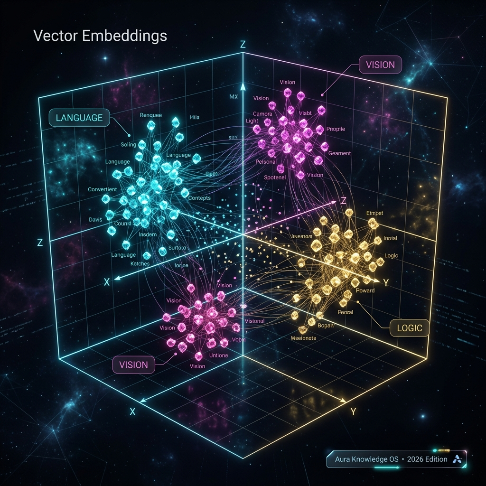

## Definition
An **Embedding** is a numerical vector (list of numbers) that represents the meaning of a word, sentence, or concept in high-dimensional space. Words with similar meanings are placed close together in this space.

## Real-World Analogy
Imagine a map where cities that are culturally similar are placed near each other — even if they're geographically far apart. Embeddings are like this, but for concepts: "king" is near "queen", "dog" is near "puppy", "Python" is near "JavaScript."

## Why It Matters in 2026
- Essential for [[RAG]] — documents are embedded and searched by semantic similarity
- Powers **Vector Databases** (Pinecone, Weaviate, Chroma) — the backbone of enterprise AI search
- Used in [[LLM]]s as the first step: every token is converted to an embedding before processing
- Enables semantic search: finding relevant results even when exact keywords don't match

## Key Relationships
- Input to: [[Transformer]], [[LLM]]
- Foundation of: [[RAG]], [[Vector Database]]
- Related: [[Token]], [[Grounding]]

## Learn More
- [YouTube: Word Embeddings](https://www.youtube.com/results?search_query=Word+Embeddings+explained)
- [Wikipedia](https://en.wikipedia.org/wiki/Word_embedding)