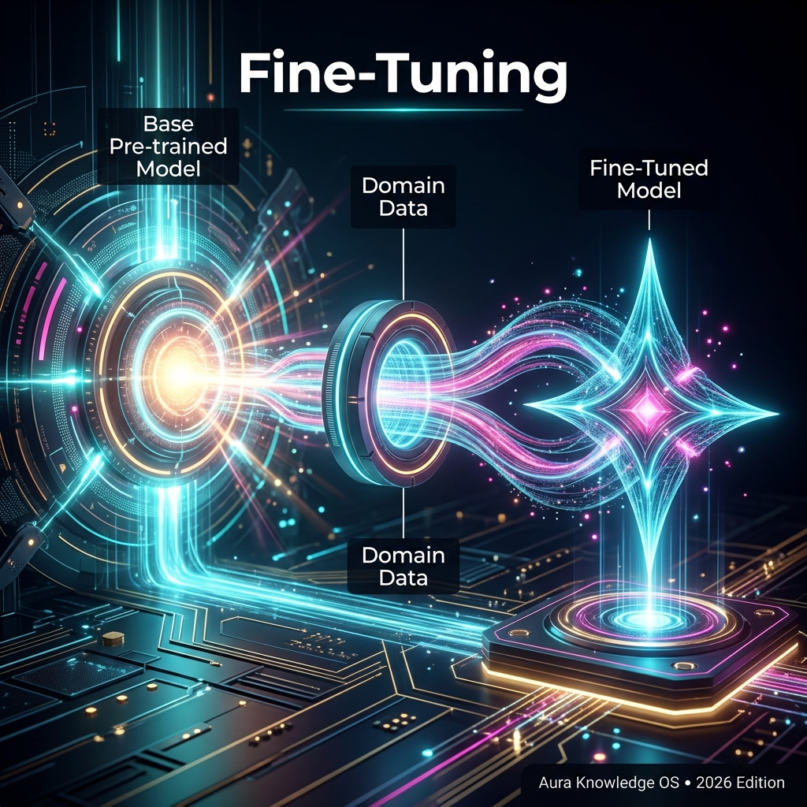

## Definition
**Fine-tuning** is the process of adapting a [[Pre-Training|pre-trained]] [[Foundation Model]] for a specific use case by training it further on a smaller, targeted dataset. It's how a general-purpose model becomes specialised.

## Types of Fine-Tuning
| Method | Description | Cost |
|---|---|---|
| **Full Fine-Tuning** | Update all parameters | Very expensive |
| **[[LoRA]]** | Update only a tiny fraction of parameters | Very cheap |
| **[[RLHF]]** | Align model with human preferences | Moderate |
| **[[DPO]]** | Direct preference optimization (no reward model) | Moderate |
| **Instruction Tuning** | Train to follow instructions | Moderate |

## Real-World Analogy
Pre-training is like getting a university degree in "everything". Fine-tuning is like doing a specialised internship — you already have broad knowledge, but now you become an expert in one area.

## Key Relationships
- Applied to: [[LLM]], [[Foundation Model]]
- Methods: [[LoRA]], [[RLHF]], [[DPO]]
- Follows: [[Pre-Training]]
- Alternative: [[RAG]] (add knowledge without retraining)

## Learn More
- [YouTube: Fine-tuning LLMs](https://www.youtube.com/results?search_query=Fine+tuning+LLMs+explained)
- [Wikipedia](https://en.wikipedia.org/wiki/Fine-tuning_%28deep_learning%29)

## Video Resources
- [Speech to Text: Fine-Tuning Generative AI for Smarter Conversational AI](https://www.youtube.com/watch?v=jEZ159wzSJY)
- [What is Retrieval-Augmented Fine-Tuning (RAFT)?](https://www.youtube.com/watch?v=rqyczEvh3D4)
- [RAG vs Fine-Tuning vs Prompt Engineering: Optimizing AI Models](https://www.youtube.com/watch?v=zYGDpG-pTho)
