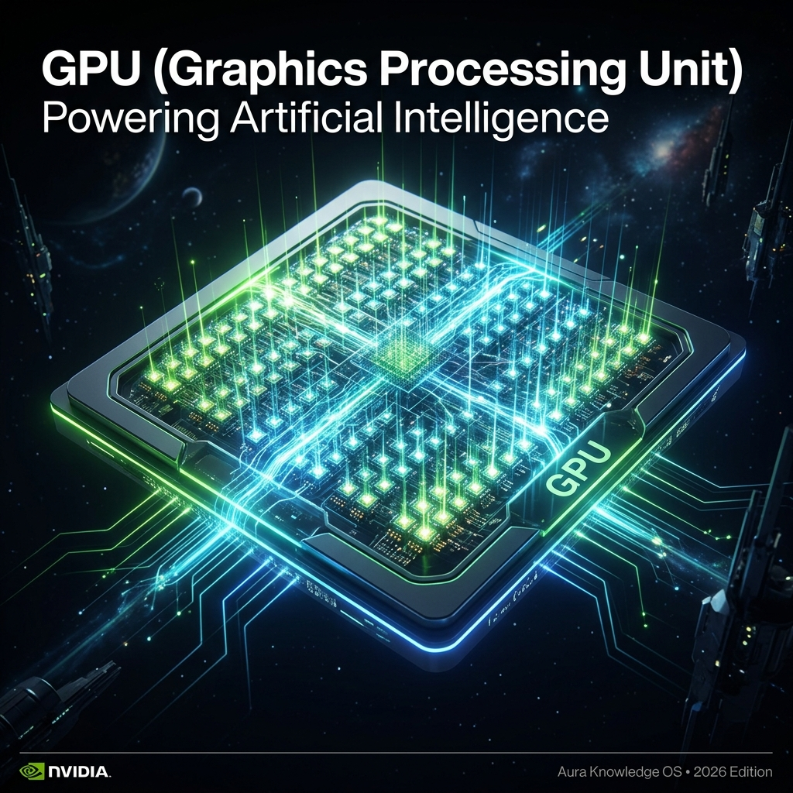

# 🎮 GPU

## Definition
**Graphics Processing Unit** — massively parallel compute chips originally designed for rendering graphics, now repurposed as the engine behind all AI training and inference. NVIDIA's A100, H100, and Blackwell B200 GPUs are the currency of the AI industry. The global GPU shortage (2023–2025) became a strategic geopolitical issue.

## How It Works (Simplified)
1. GPUs contain thousands of small cores that can perform simple math operations simultaneously
2. Neural network training involves trillions of matrix multiplications — perfectly suited for parallel GPU cores
3. A single H100 GPU can perform ~1,000 trillion operations per second (1 petaFLOP at FP16)
4. Training frontier models requires clusters of 10,000–100,000 GPUs working in concert

## Why It Matters in 2026
- NVIDIA's market cap crossed **$3 trillion** in 2024, briefly becoming the most valuable company on Earth
- US export controls on NVIDIA chips to China made GPUs a **geopolitical weapon**
- The [[CUDA]] software ecosystem creates a massive competitive moat — switching to AMD requires rewriting entire codebases
- GPU availability determines who can train frontier models and who can't

> [!tip] Key Fact
> NVIDIA's stock grew 240% in 2023 and 120% in 2024 — Jensen Huang's company is the primary financial beneficiary of the entire AI boom.

## Key Relationships
- Companies: [[NVIDIA]], [[Microsoft]] (Azure), [[Google DeepMind]] (TPUs as alternative)
- Hardware: [[ASIC]], [[NPU]], [[CUDA]]
- Usage: [[Pre-Training]], [[Inference]], [[Deep Learning]]
- Optimisation: [[Quantisation]] (fitting models on fewer GPUs)
- Hub: [[MOC - Infrastructure & Deployment]]

## Learn More
- [YouTube: How GPUs Power AI Training](https://www.youtube.com/results?search_query=GPU+AI+training+NVIDIA+explained)
- [Wikipedia: GPU](https://en.wikipedia.org/wiki/Graphics_processing_unit)
