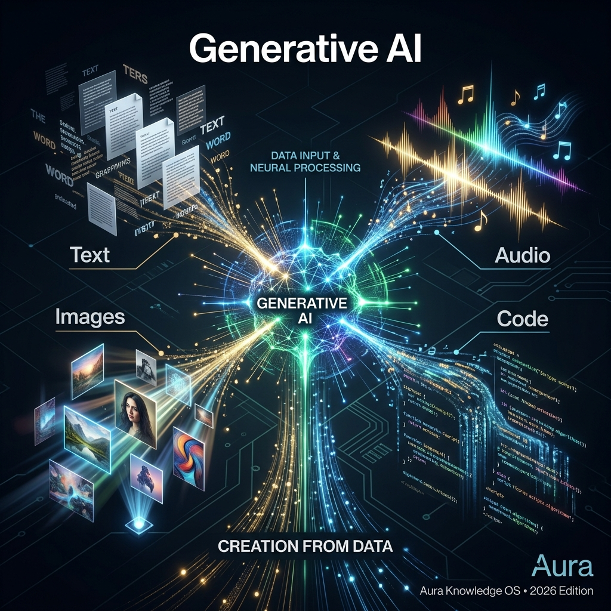

## Definition
**Generative AI** is AI that creates **new content**: text, images, audio, video, code, 3D worlds, music, and more. It is the dominant form of AI in 2026 and the technology behind tools like [[ChatGPT (OpenAI)]], [[Midjourney v7]], [[Suno v5]], [[Sora 2 (OpenAI)]], and [[ElevenLabs]].

## What It Can Generate
| Type | Tools |
|---|---|
| Text / Writing | ChatGPT, Claude, Gemini, [[Jasper]] |
| Images / Design | Midjourney, DALL-E 4, Stable Diffusion, [[Canva Magic Studio]] |
| Video | Sora 2, Runway Gen-4, Veo 3, [[Seeddance 2.0 (ByteDance)]] |
| Audio/Voice | ElevenLabs |
| Music | Suno v5, Udio |
| Code / Web | Claude Code, Cursor, GitHub Copilot, [[Builder.io]] |
| 3D Worlds | World Labs Marble, Genie 3 |

## Key Relationships
- Powered by: [[LLM]], [[Deep Learning]], [[Transformer]], [[Diffusion Model]]
- Applied in: [[Vibe Coding]], [[AI Agent]]
- Risks: [[Hallucination]], [[C2PA]], [[Deepfakes]]

## Learn More
- [YouTube: Generative AI Explained](https://www.youtube.com/results?search_query=Generative+AI+explained)
- [Wikipedia](https://en.wikipedia.org/wiki/Generative_artificial_intelligence)