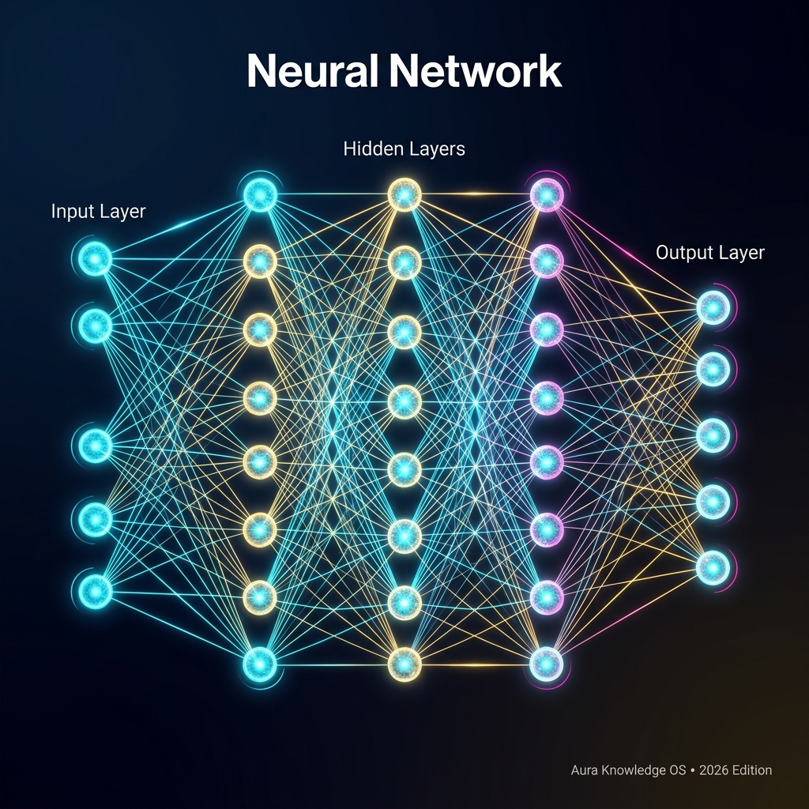

# 🕸️ Neural Network

## Definition
A **Neural Network** is a computing system inspired by the structure of the human brain. It consists of layers of interconnected nodes ("neurons") that process information by passing signals through weighted connections. [[Deep Learning]] uses neural networks with many layers (hence "deep").

## Layers
1. **Input Layer**: Receives raw data (text, image pixels, etc.)
2. **Hidden Layers**: Process and transform the data (the "deep" in deep learning)
3. **Output Layer**: Produces the final prediction or generation

## Key Variants
| Architecture | Use Case | Pioneered By |
|---|---|---|
| **Feedforward** | Basic classification | Warren McCulloch (1943) |
| **[[CNN]]** | Image recognition | [[Yann LeCun]] |
| **RNN/LSTM** | Sequential data | Sepp Hochreiter |
| **[[Transformer]]** | Language, multimodal | Google (2017) |
| **[[Diffusion Model]]** | Image/video generation | Various |
| **[[GAN]]** | Adversarial generation | Ian Goodfellow |

## Key Relationships
- Foundation of: [[Deep Learning]], [[LLM]], [[Foundation Model]]
- Trained via: [[Backpropagation]], [[Pre-Training]]
- Architectures: [[Transformer]], [[CNN]], [[GAN]], [[Diffusion Model]]

## Learn More
- [YouTube: Neural Networks — 3Blue1Brown](https://www.youtube.com/results?search_query=Neural+Networks+3Blue1Brown)
- [Wikipedia](https://en.wikipedia.org/wiki/Artificial_neural_network)

## Video Resources
- [Inside a Neuron: The Building Blocks of a Neural Network & AI](https://www.youtube.com/watch?v=H_jD5xa1nRg)
