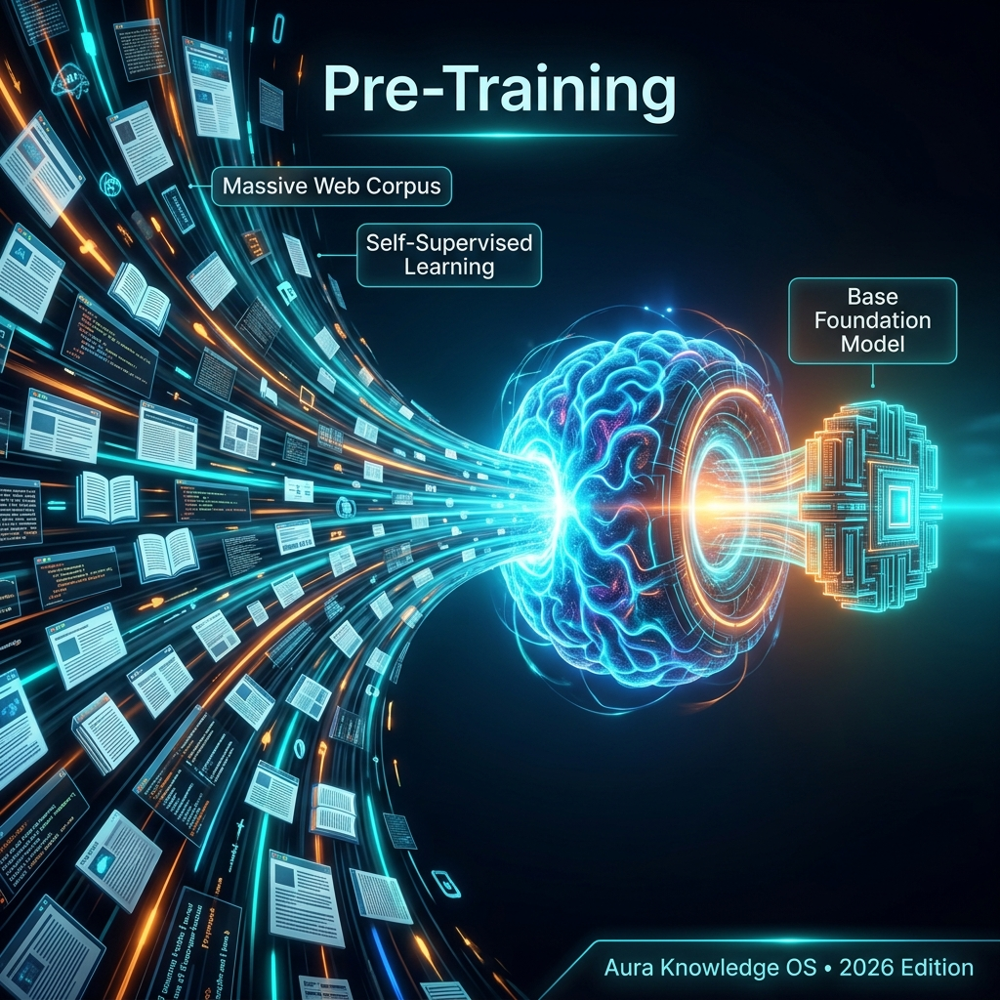

## Definition
**Pre-training** is the initial large-scale training phase where a [[Foundation Model]] learns from vast amounts of data — typically trillions of tokens from the internet, books, and code. This is the most expensive phase of building an AI model.

## Scale
- GPT-5.4: Trained on trillions of tokens across multiple data sources
- The pre-training compute for frontier models costs **$100M-$1B+**
- Requires thousands of GPUs ([[NVIDIA GPUs (Blackwell)]]) running for months

## Key Relationships
- Produces: [[Foundation Model]]
- Followed by: [[Fine-Tuning]], [[RLHF]], [[DPO]]
- Uses: [[Synthetic Data]], real-world data
- Risk: [[Model Collapse]] (from training on AI-generated data)

## Learn More
- [YouTube: LLM Pretraining](https://www.youtube.com/results?search_query=LLM+Pretraining+explained)

## Video Resources
- [GPT-4.5: And the future of pre-training is...](https://www.youtube.com/watch?v=LQEhOObUhQg)
- [Granite 3.1, NVIDIA Jetson, stealing AI models, and is pre-training over?](https://www.youtube.com/watch?v=GnMKY4QLHDw)
