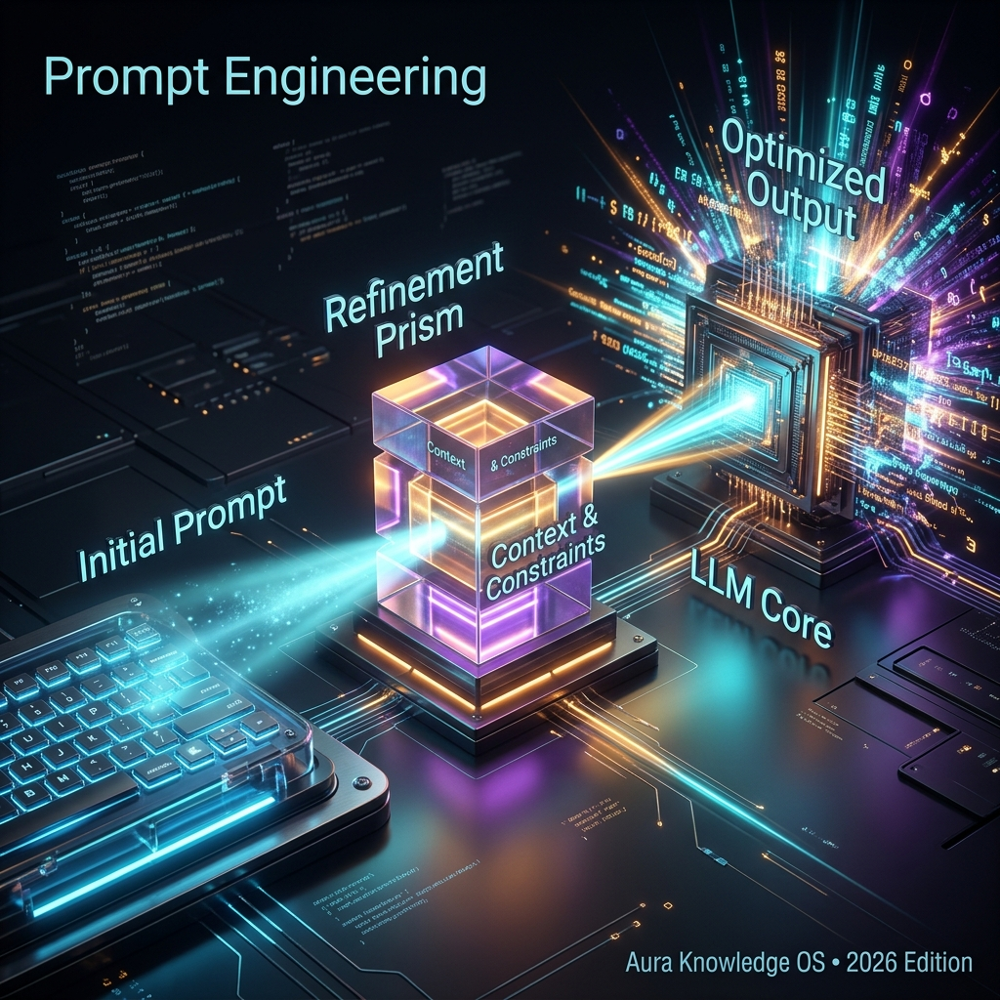

## Definition
**Prompt Engineering** is the skill of crafting instructions strategically to elicit vastly better outputs from AI models. It's one of the **most important practical skills** in 2026 — often making the difference between a mediocre and an exceptional AI response.

## Core Techniques
| Technique | What It Does | Example |
|---|---|---|
| **[[Zero-Shot]]** | Ask directly, no examples | "Translate this to French" |
| **[[Few-Shot]]** | Provide examples first | "Here are 3 examples... now do this" |
| **[[Chain-of-Thought]]** | Ask for step-by-step reasoning | "Think step by step" |
| **[[System Prompt]]** | Set background instructions | "You are a financial analyst..." |
| **Role Prompting** | Assign an expert persona | "Act as a senior developer..." |
| **Structured Output** | Request specific format | "Return JSON with these fields..." |

## Why It Matters in 2026
- The same model can give 10x better results with a better prompt
- AI companies are hiring "Prompt Engineers" as a dedicated role
- Critical for building effective [[AI Agent]]s and [[RAG]] pipelines
- The rise of [[Vibe Coding]] is essentially prompt engineering for software development

## Key Relationships
- Techniques: [[Chain-of-Thought]], [[Few-Shot]], [[Zero-Shot]], [[System Prompt]]
- Controls: [[Temperature]], [[Grounding]]
- Applied to: [[LLM]], [[AI Agent]]

## Learn More
- [YouTube: Prompt Engineering Course](https://www.youtube.com/results?search_query=Prompt+Engineering+course+2024)
- [Wikipedia](https://en.wikipedia.org/wiki/Prompt_engineering)

## Video Resources
- [How to Use Agentic AI: LLMs, AI Agents & Prompt Engineering in Action](https://www.youtube.com/watch?v=bwvfdFWR1RI)
- [Context Engineering vs. Prompt Engineering: Smarter AI with RAG & Agents](https://www.youtube.com/watch?v=vD0E3EUb8-8)
- [NEO 1X Robot, OpenAI chips, The AI Scientist, and the future of prompt engineering](https://www.youtube.com/watch?v=iSJenVM7KnQ)
- [4 Methods of Prompt Engineering](https://www.youtube.com/watch?v=1c9iyoVIwDs)
