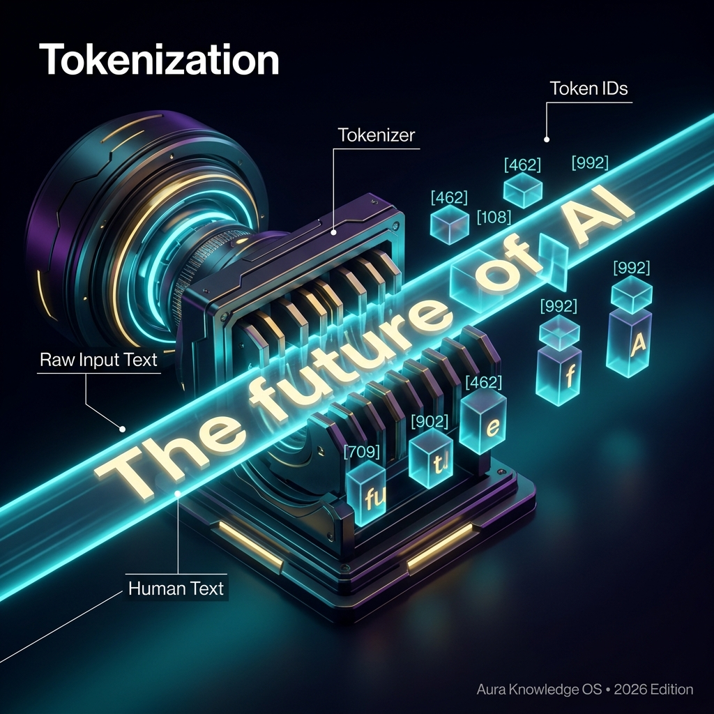

## Definition
A **Token** is the basic unit of text that an AI model processes — roughly a word or part of a word. Models don't read characters or words directly; they break text into tokens using a **tokenizer**.

## Examples
- "Hello world" → 2 tokens
- "Artificial Intelligence" → 2-3 tokens
- "unbelievable" → might be split into "un" + "believ" + "able" = 3 tokens
- ~1 token ≈ 0.75 words (on average)

## Why It Matters
- **Pricing**: API costs are calculated per token (input + output)
- **Limits**: The [[Context Window]] is measured in tokens
- **Speed**: Inference speed is measured in tokens/second
- 1M tokens ≈ 750,000 words ≈ ~4 average novels

## Key Relationships
- Fills: [[Context Window]]
- Processed by: [[Transformer]], [[LLM]]
- Represented as: [[Embedding]]
- Cached in: [[KV Cache]]

## Learn More
- [YouTube: Tokenization](https://www.youtube.com/results?search_query=Tokenization+LLM+explained)
- [OpenAI Tokenizer](https://platform.openai.com/tokenizer)