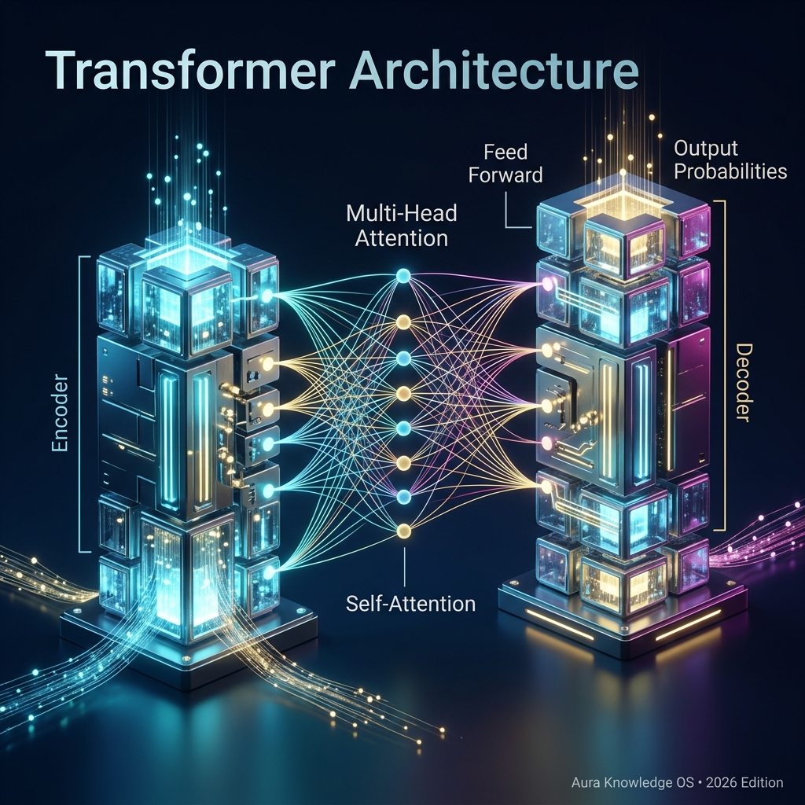

## Definition
The **Transformer** is the neural network architecture behind virtually all modern AI. Introduced in the landmark 2017 paper *"Attention Is All You Need"* by researchers at Google (co-authored by [[Aidan Gomez]]), it replaced older architectures (RNNs, LSTMs) by processing all tokens in parallel using the [[Attention]] mechanism.

## How It Works (Simplified)
1. **Tokenization**: Input text is split into [[Token]]s (words or sub-words)
2. **Embedding**: Each token is converted into a numerical vector ([[Embedding]])
3. **Self-Attention**: The model computes how much each token should "attend to" every other token — capturing relationships across the entire input
4. **Feed-Forward**: Attention outputs pass through dense neural network layers
5. **Output**: The model predicts the probability distribution for the next token

## Real-World Analogy
Imagine reading a sentence and being able to instantly understand how every word relates to every other word — all at once, rather than reading left-to-right. That parallel comprehension is what self-attention gives the Transformer.

## Why It Matters in 2026
- **Every major LLM** is built on the Transformer: GPT-5.4, Claude Opus 4.6, Gemini 3.1, Grok 4.20
- The architecture has proven remarkably scalable — more parameters + more data = better performance
- Alternative architectures like [[SSM]] (Mamba) are emerging for ultra-long sequences, but Transformers remain dominant
- The original paper has been cited over 130,000 times — one of the most influential papers in computing history

## Key Relationships
- Core mechanism: [[Attention]], [[Embedding]], [[Token]], [[Parameters]]
- Performance: [[KV Cache]], [[MoE]], [[Context Window]]
- Powers: [[LLM]], [[Generative AI]], [[Multimodal AI]]
- Alternatives: [[SSM]]

## Learn More
- [YouTube: 3Blue1Brown — Transformers](https://www.youtube.com/results?search_query=Transformer+Neural+Network+3Blue1Brown)
- [Original Paper: Attention Is All You Need](https://arxiv.org/abs/1706.03762)